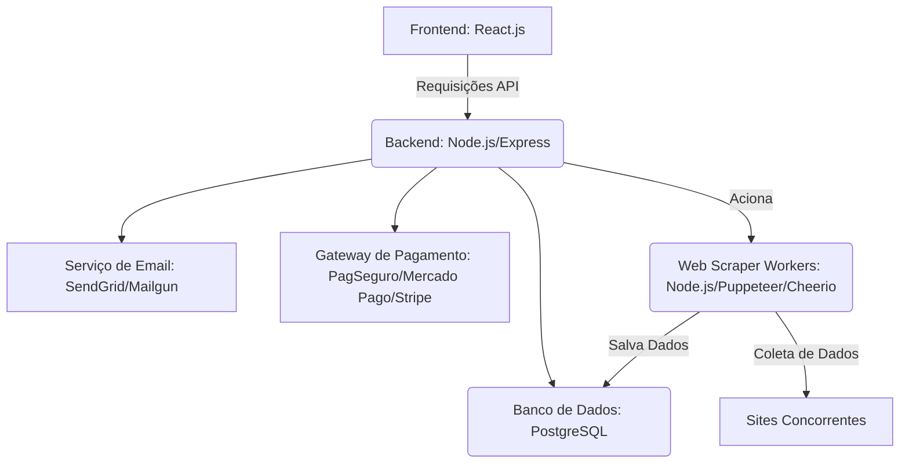

# 🚀 Projeto Micro SaaS: Validador Inteligente de Preços para E-commerce

---

## 💡 1. Resumo Executivo

O **Validador Inteligente de Preços para E-commerce** é um Micro SaaS (Software as a Service) inovador, projetado para ser a **ferramenta essencial para pequenos e médios e-commerces** no Brasil e em mercados competitivos. Nosso objetivo é transformar a maneira como lojistas definem seus preços, passando de "achismos" para **decisões estratégicas baseadas em dados**.

Em um ambiente online onde os preços mudam a todo instante, a falta de visibilidade sobre a concorrência resulta em:

* **Vendas perdidas:** Seu produto pode ser ligeiramente mais caro que o concorrente, e você nem sabe.
* **Margem sacrificada:** Você pode estar vendendo mais barato do que o necessário, perdendo lucro.
* **Tempo e esforço desperdiçados:** O monitoramento manual de preços é inviável e ineficaz.

Nossa solução automatiza esse processo crítico, oferecendo **insights em tempo real, alertas acionáveis e sugestões de preços** para que o lojista possa maximizar suas vendas e sua margem de lucro. Este SaaS se destaca por resolver uma dor de mercado real e generalizada, com um modelo de negócio de assinatura claro e um escopo de MVP que permite uma validação rápida e um potencial de crescimento massivo.

---

## ✨ 2. Definição do Produto (MVP - Minimum Viable Product)

O MVP deste SaaS focará nas funcionalidades mais impactantes para entregar valor rapidamente aos lojistas.

### Funcionalidades Essenciais do MVP:

* **1. Cadastro de Usuários (Lojistas):**
    * Formulário de registro com e-mail, senha (hash seguro) e nome da empresa.
    * Sistema de login e recuperação de senha.
* **2. Gestão de Planos de Assinatura:**
    * Página de visualização dos planos disponíveis (Básico, Pro, etc.) com seus respectivos limites (produtos monitorados, frequência de scraping).
    * Integração básica para iniciar a assinatura (ex: redirecionamento para link de pagamento do gateway).
    * Registro do plano ativo para cada usuário.
* **3. Dashboard Intuitivo do Lojista:**
    * Visão geral do status de monitoramento (produtos monitorados vs. limite do plano).
    * Exibição dos alertas mais recentes (preço desfavorável, concorrente mudou preço, etc.).
    * Resumo do status de precificação dos produtos.
* **4. Cadastro e Edição de Produtos:**
    * Interface para o lojista adicionar produtos que deseja monitorar.
    * Campos: **Nome do Produto**, **SKU/ID Interno**, **Seu Preço Atual**, **URL do Produto na Sua Loja**.
    * Funcionalidade para editar ou desativar o monitoramento de produtos.
* **5. Configuração de Concorrentes por Produto:**
    * Para cada produto cadastrado, o lojista pode informar as **URLs diretas dos mesmos produtos em sites de concorrentes**.
    * Campos: **Nome do Concorrente** (ex: "Magalu", "Amazon"), **URL Específica do Produto no Concorrente**.
    * Permite múltiplos concorrentes por produto.
* **6. Monitoramento Automatizado de Preços (Web Scraping):**
    * Um **backend worker** (o "robô") visita periodicamente as URLs configuradas pelos lojistas.
    * Extrai o **preço do produto**, status de estoque e título do concorrente.
    * Armazena um **histórico de preços** para cada produto/concorrente.
    * A frequência de monitoramento é definida pelo plano de assinatura do usuário.
* **7. Alertas e Notificações (E-mail):**
    * Sistema que compara os preços coletados e gera alertas automáticos em situações críticas:
        * Preço do lojista está significativamente mais alto.
        * Concorrente-chave alterou o preço.
        * Concorrente ficou sem estoque (oportunidade de vendas para o lojista).
    * Envio de e-mails com esses alertas.
* **8. Sugestão de Preço (Básica):**
    * Exibe uma sugestão de preço no dashboard, baseada no menor preço encontrado entre os concorrentes (com um fator de ajuste de margem/desconto configurável pelo lojista ou plano).
* **9. Painel de Administração (Para Você):**
    * Interface para listar e gerenciar todos os usuários (lojistas).
    * Visão de qual plano cada usuário está utilizando e seu status de assinatura.
    * Capacidade de **ativar/desativar o acesso de um usuário** ao sistema.
    * Monitoramento simples do uso de produtos monitorados por cada usuário.

### 📝 Funcionalidades Fora do Escopo do MVP (Próximos Passos):

* Integração direta com APIs de e-commerce (Shopify, Tray, VTex) para sincronização automática de produtos e preços.
* Monitoramento de custos de frete simulado por CEP.
* Análise de tendências e projeções de preços com gráficos avançados.
* Geração de relatórios personalizáveis de desempenho e competitividade.
* Integração com gateways de pagamento para assinaturas recorrentes e automatizadas.
* Alertas via Slack, WhatsApp ou notificações push.
* Soluções avançadas anti-bloqueio para scraping (proxies rotativos, CAPTCHA solving).

---

## 🛠️ 3. Arquitetura Técnica Sugerida (MVP)

Uma arquitetura **separada de front-end e back-end** é ideal para permitir escalabilidade e manutenção.

### Detalhes Técnicos:

* **Backend:**
    * **Linguagem/Framework:** **Node.js** com **Express.js** (devido à sua capacidade assíncrona para I/O e a compatibilidade com ferramentas de scraping JS).
    * **Bibliotecas Essenciais:**
        * `axios`: Para requisições HTTP (obter HTML).
        * `cheerio`: Para parsear HTML (para sites mais estáticos).
        * `puppeteer` ou `playwright`: **Crucial** para scraping de sites dinâmicos (renderizam conteúdo com JavaScript), permitindo simular um navegador real.
        * `bcrypt`: Para hash seguro de senhas.
    * **API:** RESTful para comunicação com o frontend e com os workers.
* **Frontend:**
    * **Framework:** **React.js** (ou Vue.js), para uma interface de usuário moderna, reativa e responsiva.
    * **Design:** Foco em UX/UI simples e eficiente. Pode-se usar bibliotecas como Tailwind CSS para agilidade ou um framework de componentes como Material UI.
* **Banco de Dados:**
    * **Tipo:** **PostgreSQL**. Escolha robusta, relacional e open-source, ideal para armazenar dados estruturados e históricos de preços.
    * **Esquema de Tabelas (Resumido):**
        * `usuarios`: Informações básicas dos lojistas.
        * `planos`: Detalhes dos planos de assinatura oferecidos.
        * `assinaturas`: Conecta usuários a planos, gerencia status e datas de assinatura.
        * `produtos_monitorados`: Produtos do lojista a serem monitorados.
        * `concorrentes_produtos`: URLs de produtos dos concorrentes associadas a cada produto do lojista.
        * `historico_precos`: Registro de todos os preços coletados ao longo do tempo.
* **Agendamento de Tarefas (Workers/Jobs):**
    * Para executar o web scraping periodicamente. Pode ser implementado com `node-cron` para MVP ou um sistema de fila como `bullmq` para escalabilidade futura.
    * Os workers consultarão a tabela `assinaturas` para verificar o status ativo e os limites de cada plano antes de iniciar o scraping.
* **Serviços Externos:**
    * **Gateway de Pagamento:** Integrar com serviços como PagSeguro, Mercado Pago, Stripe para processar pagamentos das assinaturas.
    * **Serviço de Envio de E-mails:** Usar APIs de SendGrid, Mailgun ou AWS SES para envio automatizado de alertas e notificações.
* **Hospedagem (Cloud):**
    * **Frontend:** Vercel, Netlify (hosting estático/serverless functions).
    * **Backend & Workers:** Render, Railway, DigitalOcean Droplets, AWS EC2/Lambda (para processos em background).
    * **Banco de Dados:** DigitalOcean Managed Databases (PostgreSQL), AWS RDS (PostgreSQL).

---

## 🗺️ 4. Desenvolvimento Passo a Passo (Roadmap do MVP)

Este roadmap detalha as fases de construção do MVP.

### Fase 1: Fundação do Projeto

* **Configuração do Ambiente:** Instalação de Node.js, npm, PostgreSQL. Configuração de ambiente de desenvolvimento (ex: VS Code, Docker).
* **Inicialização do Projeto:** Criar estrutura básica de pastas para frontend e backend. Inicializar repositórios Git.
* **Banco de Dados:** Criar o banco de dados PostgreSQL e as tabelas essenciais (`usuarios`, `planos`, `assinaturas`) com seus campos e chaves primárias/estrangeiras.

### Fase 2: Autenticação e Gestão de Assinaturas

* **APIs de Autenticação (Backend):** Desenvolver endpoints para registro (`/api/auth/register`) e login (`/api/auth/login`). Implementar hash de senhas com `bcrypt`.
* **Interface de Autenticação (Frontend):** Criar as telas de registro, login e recuperação de senha. Consumir as APIs de autenticação.
* **Painel de Administração (Para Você):** Construir uma interface simples para você (admin) gerenciar usuários e seus respectivos planos/status de assinatura. Funcionalidade para ativar/desativar usuários.
* **Gestão de Planos de Assinatura:**
    * Criar a tabela `planos` e popular com os planos iniciais.
    * Desenvolver a lógica para que um usuário possa "escolher" um plano e registrar na tabela `assinaturas` (início da assinatura).
    * Integração inicial com gateway de pagamento (MVP: redirecionamento para link de pagamento, atualização manual do status da assinatura após confirmação externa).

### Fase 3: Cadastro de Produtos e Concorrentes

* **Estrutura de Dados:** Adicionar as tabelas `produtos_monitorados` e `concorrentes_produtos` ao banco de dados.
* **Interface de Produtos (Frontend):** Criar a tela onde o lojista pode:
    * Adicionar novos produtos (Nome, SKU, Seu Preço, URL da Sua Loja).
    * Listar seus produtos já cadastrados.
* **Interface de Concorrentes (Frontend):** Para cada produto, permitir que o lojista adicione URLs de concorrentes específicos (Nome do Concorrente, URL do Produto no Concorrente).
* **APIs de Gestão (Backend):** Implementar endpoints para CRUD (Criar, Ler, Atualizar, Deletar) de produtos e seus concorrentes, vinculados ao `usuario_id`.

### Fase 4: Módulo de Web Scraping

* **Desenvolvimento do Scraper:** Criar um script Node.js separado que pode ser executado como um worker. Este script receberá uma URL de concorrente e, usando `puppeteer`/`playwright` (para sites dinâmicos) ou `axios`/`cheerio` (para sites estáticos), extrairá o preço, título e status de estoque.
* **Armazenamento de Dados:** Após a coleta, salvar os dados na tabela `historico_precos` e atualizar `concorrentes_produtos` com o último preço e data/hora da coleta.
* **Agendamento:** Configurar um mecanismo para que o script de scraping seja executado periodicamente para cada `concorrente_produto` de `usuarios` com `assinatura.status = 'ativa'`, respeitando a `freq_monitoramento_horas` do plano do usuário e o `limite_produtos`.

### Fase 5: Dashboard e Alertas

* **Dashboard do Lojista (Frontend):**
    * Construir a tela principal do lojista, exibindo uma tabela comparativa dos produtos: seu preço vs. preços dos concorrentes.
    * Usar dados das tabelas `produtos_monitorados`, `concorrentes_produtos` e o `historico_precos` mais recente.
    * Exibir a sugestão de preço básica.
* **Lógica de Alertas (Backend):** Implementar uma função que, após cada ciclo de scraping, analisa os dados e identifica situações de alerta (preço desfavorável, mudança de concorrente, falta de estoque do concorrente).
* **Envio de E-mails:** Integrar com o serviço de e-mail (SendGrid/Mailgun) para enviar os alertas personalizados aos lojistas.

### Fase 6: Testes e Implantação (Deploy)

* **Testes:** Realizar testes de unidade (APIs, funções de scraping), testes de integração e testes de ponta a ponta.
* **Preparação para Deploy:**
    * Containerização da aplicação (Docker) para facilitar a implantação.
    * Configuração de variáveis de ambiente e segredos de produção.
* **Hospedagem:**
    * Deploy do frontend (Vercel/Netlify).
    * Deploy do backend e workers (Render/Railway/DigitalOcean).
    * Configurar o banco de dados PostgreSQL na nuvem.
* **Lançamento:** Configurar domínio, SSL e monitorar os logs e a performance do sistema.

---

## ⚠️ 5. Considerações Importantes

* **Ética e Legalidade do Web Scraping:**
    * Sempre respeitar os arquivos `robots.txt` dos sites alvo.
    * Evitar sobrecarregar os servidores dos concorrentes com requisições excessivas (implementar atrasos e limitar a frequência).
    * Focar apenas em dados públicos de preços, não em informações pessoais ou protegidas.
* **Estratégia de Precificação do SaaS:**
    * Definir um modelo de preços que reflita o valor gerado (economia, aumento de lucro) para o lojista.
    * Considerar um plano gratuito com funcionalidades limitadas ou um período de teste gratuito para atrair usuários.
* **Marketing e Vendas:**
    * Criar uma landing page clara, destacando os benefícios diretos (mais vendas, mais lucro, menos dor de cabeça).
    * Focar em nichos específicos de e-commerce no início para validação rápida.
    * Produzir conteúdo relevante (blog, vídeos) sobre precificação e competitividade online.
* **Suporte ao Cliente:**
    * Estabelecer canais claros para suporte e feedback dos usuários desde o início.
* **Escalabilidade Futura:**
    * Embora seja um MVP, pensar em como a arquitetura pode crescer para suportar mais usuários, produtos e frequência de monitoramento.

---

## 🛑 6. Riscos e Desafios

* **Adaptação a Mudanças em Sites Concorrentes (Anti-Scraping):** Este é o maior desafio técnico. Sites podem mudar layouts, ofuscar dados ou implementar barreiras (CAPTCHAs, bloqueios de IP). Isso exige manutenção constante e talvez a implementação de soluções mais robustas (proxies rotativos, reconhecimento de CAPTCHAs).
* **Precisão e Latência dos Dados:** Garantir que os preços coletados são sempre precisos e que a atualização ocorre em tempo hábil para o lojista reagir.
* **Concorrência no Mercado:** Existem ferramentas maiores e mais caras. O diferencial do seu Micro SaaS será a simplicidade, foco no problema da PME e um custo-benefício atraente.
* **Custo de Infraestrutura:** O uso de Puppeteer/Playwright pode consumir mais recursos (CPU, RAM) do servidor, impactando os custos de hospedagem à medida que a base de usuários cresce.

---

## 📈 7. Conclusão

O **Validador Inteligente de Preços para E-commerce** é um projeto com alto potencial de sucesso. Ao resolver uma dor crítica de forma eficiente e automatizada, você oferece um serviço indispensável que ajuda pequenos e médios e-commerces a sobreviverem e prosperarem em um mercado cada vez mais disputado.

Este `README.md` serve como um guia abrangente para iniciar o desenvolvimento do seu MVP. Foco na entrega de valor e no feedback dos usuários será a chave para o sucesso e a evolução contínua do seu produto.

---

